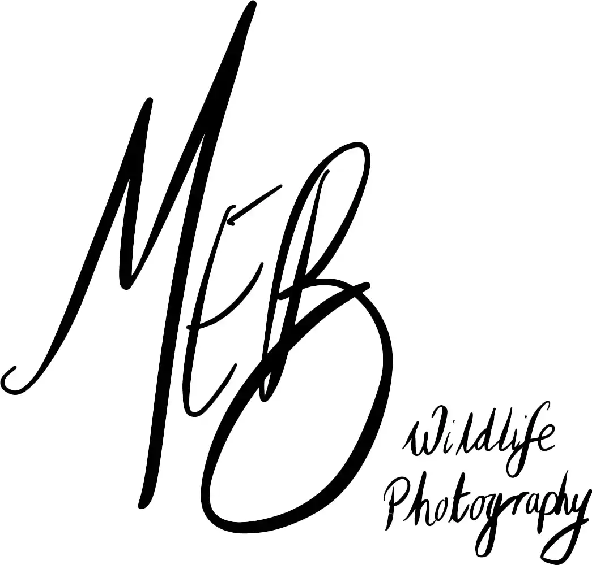

# MEB Wildlife Photography: Discover Nature

## I would like to share my journey and passion of nature, landscapes and photography. The aim of this website is to be eye catching and enjoyable for people who have an interest in amateur photography, location and landscape photography and species photography. On this website you will get to experience some of the locations I have visited and photographed as well as some of the amazing organisms you can find accessible to that location. The website will also provide information about the location photographed and the species you may find there. This website is aimed at users who have a passion for nature photography both landscape and species and for those who like me, are armature photographers. Navigation through the website will be accomplished through a navigation bar which will remain constant at the top of the page in desktop view and shrink to a drop-down menu in mobile view. The footer of the website will remain constant on all pages and have links to all my social media. The website will be split into 4 main sections. “Home” will be eye catching and give a summary of what the user can expect to find on the website. “Photos” will display all the different galleries of photos I have taken. “About” will provide information about me and how I got into natural photography as well as the equipment I use. It will also contain information about upcoming projects. “Contact” will give the user the opportunity to contact me, post on a message board and provide useful links. I hope you will enjoy the content I have created and my passion for all things nature likes to offer.

# User Experience

## User Stories

### Owners Site Goals

*	Show the owners journey into amateur photography.
*	Portray owners passion for landscape/wildlife photography.
*	Connect people with a passion for landscape/wildlife photography.
*	Provide information / education on the species photographed.
*	Provide information / education on the landscapes photographed.
*	Allow for comments on owners work.
*	Allow for comments on upcoming projects.
*	Provide useful links to support other amateur photographers.

### First Time Views Goals

*	As an individual who has a passion for landscape/wildlife photography, I want to know what the website is about and see clear navigation. 
*	I want to be able to see and use the navigation bar to easily move to the different sections on the website.
*	I want to be able to see the galleries and where these pictures were taken.
*	I want to see information regarding the locations and species photographed.
*	I want to know what equipment has been used to take these photographs.
*	I want to be able to connect to the owners social media.
*	I want to be able to see comments others have left.

### Returning Visitor Goals

*	I want to find new galleries of different locations and wildlife.
*	I want to learn new information about locations and species photographed.
*	I want to find ways to get in touch if I have any questions.
*	I want to find links that I can benefit from.
*	I want to find information about upcoming projects.
*	I want to find comments left by the owner and other users on the galleries.

### Frequent User Goals

*	I want to check for updated galleries and locations.
*	I want to check for new information on landscapes and species photographed.
*	I want to check for updates on equipment used to take the photographs. 
*	I want to find links to social media.
*	I want to find tips on photography and photographing nature. 
*	I want to see updates on upcoming projects. 
*	I want to see comments left by other users and the owner on galleries and upcoming projects.
*	I want to find links to useful websites.

## Design

### Colour Scheme

* Simplistic black text on white background with vibrant colours from the photographs.

### Typography

*	The Montserrat font is the main font used throughout the whole website with Sans Serif as the fallback font in case for any reason the font isn't being imported into the site correctly. Montserrat is a clean font used frequently in programming, so it is both attractive and appropriate.

### Imagery

*	Imagery is critical. A large hero image banner is designed to be eye catching whilst being consistent in all main pages on the website. The image will change on each main page, but the size and location will remain constant. These images should be striking and catch the users attention.

## Wire-Frame

*	Main page:
[Desktop](assets/wireframes/Home.png) /   [Mobile](assets/wireframes/homemobile.png)
*	Photos:
[Desktop](assets/wireframes/photos.png) /  [Mobile](assets/wireframes/photomobile.png)
*	Galleries:
[Desktop](assets/wireframes/gallery.png) /  [Mobile](assets/wireframes/gallerymobile.png)
*	About:
[Desktop](assets/wireframes/about.png) /    [Mobile](assets/wireframes/aboutmobile.png)
*	Contact:
[Desktop](assets/wireframes/contact.png) /   [Mobile](assets/wireframes/contactmobile.png)

## Features

*	Responsive design on all devices
*	Interactive elements

## Languages

*	[CSS](https://en.wikipedia.org/wiki/CSS)
*	[HTML5](https://en.wikipedia.org/wiki/HTML5)

## Framework, Languages and Programs Used

1. [Bootstrap 4.1](https://getbootstrap.com/docs/4.1/getting-started/introduction/)
   *Bootstrap was used to help make the website more responsive and aid with the styling of the website.
  
2. [Google Fonts](https://fonts.google.com/)
   *Google Fonts was used to import different font styles to be used in styling of the website.
  
3. [Git](https://git-scm.com/)
   *Git was used to store the projects code after being phushed from Git.

4. [GitHub](https://github.com/)
   *GitHub is used to store the projects code after being pushed from Git.

5. [Photoshop](https://www.adobe.com/ie/products/photoshop.html)
   *Photoshop was used for all photo editing and watermarks.

6. [Adobe Xd](https://helpx.adobe.com/support/xd.html)
   *Xd was used to create the wire frames for the project.

7. [Adobe Lightroom](https://www.adobe.com/uk/products/photoshop-lightroom.html)
   *Lightroom was used to process and edit photos.

# Testing 

## Lighthouse results:

The W3C Markup Validator and W3C CSS Validator Services were used to validate every page of the project to ensure there were no syntax errors in the project.

* [W3C Markup Validator](https://validator.w3.org/#validate_by_input+with_options)

* [W3C CSS Validator](https://jigsaw.w3.org/css-validator/#validate_by_input)

To Do.

Enable larger preview of each image.
Add a blog posting board
add a calander feature to show where and when I will be taking photos
adapt the site into a hiking / photography website.
