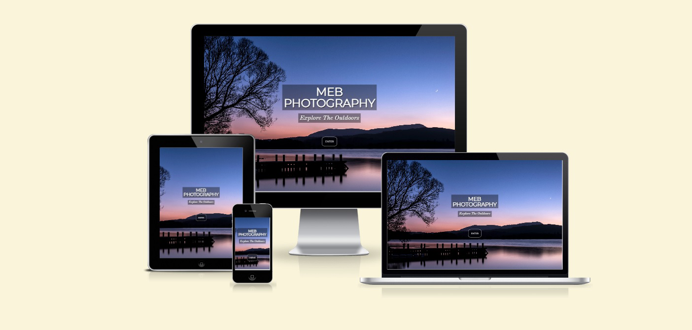
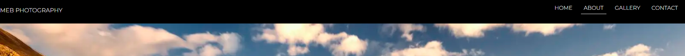
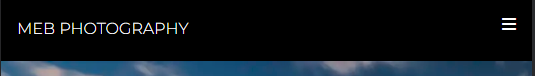
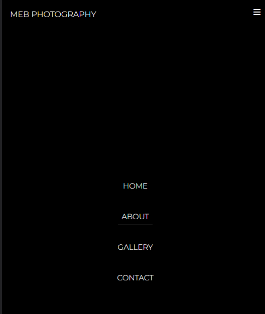
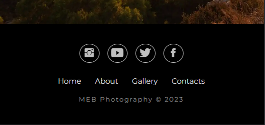
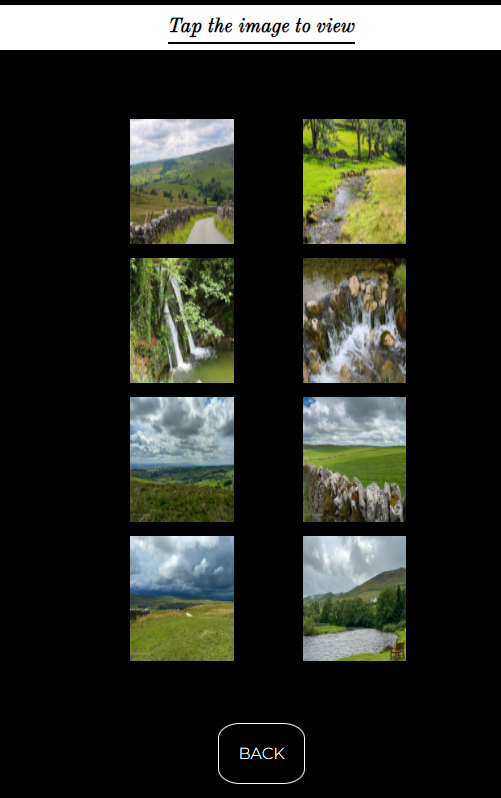
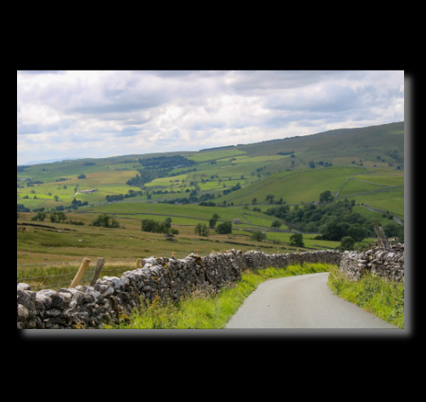
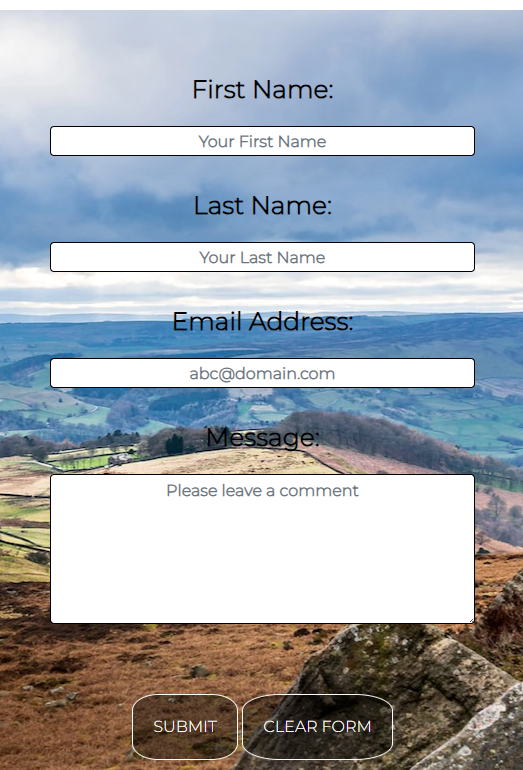
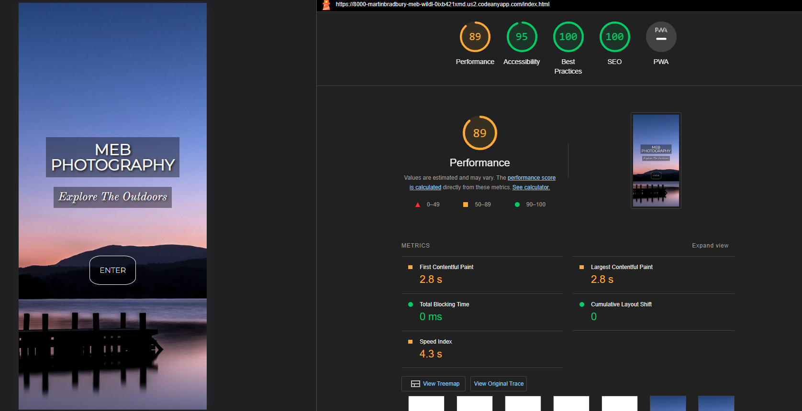

# MEB Photography: Explore the Outdoors

I would like to share my journey and passion of nature, landscapes and photography. The aim of this website is to be eye catching and enjoyable for people who have an interest in amateur photography, location and landscape photography and species photography. On this website you will get to experience some of the locations I have visited and photographed as well as some of the amazing organisms you can find accessible to that location. The website will also provide information about the location photographed and the species you may find there. This website is aimed at users who have a passion for nature photography both landscape and species and for those who like me, are armature photographers. Navigation through the website will be accomplished through a navigation bar which will remain constant at the top of the page in desktop view and shrink to a drop-down menu in mobile view. The footer of the website will remain constant on all pages and have links to all my social media. The website will be split into 4 main sections. “Home” will be eye catching and give a summary of what the user can expect to find on the website. “Photos” will display all the different galleries of photos I have taken. “About” will provide information about me and how I got into natural photography as well as the equipment I use. It will also contain information about upcoming projects. “Contact” will give the user the opportunity to contact me, post on a message board and provide useful links. I hope you will enjoy the content I have created and my passion for all things nature likes to offer.

# User Experience

## User Stories

### Owners Site Goals

*	Show the owners journey into amateur photography.
*	Portray owners passion for landscape/wildlife photography.
*	Connect people with a passion for landscape/wildlife photography.
*	Provide information / education on the species photographed.
*	Provide information / education on the landscapes photographed.
*	Allow for comments on owners work.
*	Allow for comments on upcoming projects.
*	Provide useful links to support other amateur photographers.

### First Time Views Goals

*	As an individual who has a passion for landscape/wildlife photography, I want to know what the website is about and see clear navigation. 
*	I want to be able to see and use the navigation bar to easily move to the different sections on the website.
*	I want to be able to see the galleries and where these pictures were taken.
*	I want to see information regarding the locations photographed.
*	I want to know what equipment has been used to take these photographs.
*	I want to be able to connect to the owners social media.
*	I want to be able to see comments others have left.

### Returning Visitor Goals

*	I want to find new galleries of different locations and wildlife.
*	I want to learn new information about locations and species photographed.
*	I want to find ways to get in touch if I have any questions.
*	I want to find links that I can benefit from.
*	I want to find information about upcoming projects.
*	I want to find comments left by the owner and other users on the galleries.

### Frequent User Goals

*	I want to check for updated galleries and locations.
*	I want to check for new information on landscapes and species photographed.
*	I want to check for updates on equipment used to take the photographs. 
*	I want to find links to social media.
*	I want to find tips on photography and photographing nature. 
*	I want to see updates on upcoming projects. 
*	I want to see comments left by other users and the owner on galleries and upcoming projects.
*	I want to find links to useful websites.

## Design

### Colour Scheme

* Simplistic black text on white background with vibrant colours from the photographs.

### Typography

* The montserrat is the main font used throughout the whole website for headings and navigation with Old Standard TT being used for descriptsions and content. Sans Serif is used as the fallback font in case for any reason the font isn't being imported into the site correctly. Montserrat is a clean font so it is both attractive and appropriate. Old Standard TT helps with styling descriptive sections of the website.

### Imagery

* Imagery is critical. Consistent use of photographs throughout the website to showcase the different images I have taken. Images with have shadowing effect to look like they are lifted off the page slightly. These images should be striking and catch the users attention. Gallery pages will have clickable thumbnail images which will drop down a larger version of the image for the user to view. On drop down, the background will go dark and only the image will be viewable until and second click. This will remove any distraction on the page when viewing the larger images.

## Wire-Frame

*	Main page:
[Desktop](assets/wireframes/Home.png) /   [Mobile](assets/wireframes/homemobile.png)
*	Photos:
[Desktop](assets/wireframes/photos.png) /  [Mobile](assets/wireframes/photomobile.png)
*	Galleries:
[Desktop](assets/wireframes/gallery.png) /  [Mobile](assets/wireframes/gallerymobile.png)
*	About:
[Desktop](assets/wireframes/about.png) /    [Mobile](assets/wireframes/aboutmobile.png)
*	Contact:
[Desktop](assets/wireframes/contact.png) /   [Mobile](assets/wireframes/contactmobile.png)

## Wire-Frames V2

*   Main Page:
[Desktop](assets/wireframes/homev2d.png)    /   [Mobile](assets/wireframes/homev2m.png)
*   Gallery Navigation:
[Desktop](assets/wireframes/gallerynavv2d.png) /  [Mobile](assets/wireframes/gallerynavv2m.png)
*	Galleries:
[Desktop](assets/wireframes/galleryv2d.png) /  [Mobile](assets/wireframes/galleryv2m.png)
*	About:
[Desktop](assets/wireframes/aboutv2d.png) /    [Mobile](assets/wireframes/aboutv2m.png)
*	Contact:
[Desktop](assets/wireframes/contactv2d.png) /   [Mobile](assets/wireframes/contactv2m.png)

## Features

###	Responsive design on all devices

*  Responsive Nav bar that can be clicked to navigate to each page on the website

    
    

    
    
*   Hamburger menu to help navigate the site on smaller screens
  
    
    
    

*   Interactive footer than enables users to click and navigate to social media sites

    

    
    
    
*	Interactive elements in the gallery section of the page where the user is able to click on an image thumbnail an get a larger version

    

    

    

*   Interactive form to complete in the contact section

    

## Languages

*	[CSS](https://en.wikipedia.org/wiki/CSS)
*	[HTML5](https://en.wikipedia.org/wiki/HTML5)

## Framework, Languages and Programs Used

1. [Bootstrap 4.1](https://getbootstrap.com/docs/4.1/getting-started/introduction/)
   *Bootstrap was used to help make the website more responsive and aid with the styling of the website.
  
2. [Google Fonts](https://fonts.google.com/)
   *Google Fonts was used to import different font styles to be used in styling of the website.
  
3. [Git](https://git-scm.com/)
   *Git was used to store the projects code after being pushed from Git.

4. [GitHub](https://github.com/)
   *GitHub is used to store the projects code after being pushed from Git.

5. [Photoshop](https://www.adobe.com/ie/products/photoshop.html)
   *Photoshop was used for all photo editing and watermarks.

6. [Adobe Xd](https://helpx.adobe.com/support/xd.html)
   *Xd was used to create the wire frames for the project.

7. [Adobe Lightroom](https://www.adobe.com/uk/products/photoshop-lightroom.html)
   *Lightroom was used to process and edit photos.

# Testing 

## User Testing

The website has been published on GitHub pages and I have shared it with friends, family and peer-code-review on slack. Following feedback from these sources and from my mentor I have implemented slight changes to the design, layout and responsiveness of the website. The website is responsive for different screen sizes and all the content is visible on all devices tested.

## Lighthouse results:
I have used the developer tools in google chrome to test each page in my website for performance, accessibility, best practise and SEO. Below is an example of the homepage.
 
* Mobile

* Desktop

The W3C Markup Validator and W3C CSS Validator Services were used to validate every page of the project to ensure there were no syntax errors in the project.

* [W3C Markup Validator](https://validator.w3.org/#validate_by_input+with_options)

* [W3C CSS Validator](https://jigsaw.w3.org/css-validator/#validate_by_input)

## Bugs

* The font style Old Standard TT is not available on IOS mobile and tablet devices. The default - sans serif is used instead.

# Deployment

* The website has been deployed to GitHub pages. 
* The live link can be found here:  https://martinbradbury.github.io/MEB-wildlife-photography/index.html

# Credits 

* [W3schools](https://www.w3schools.com/) - one of the best library of explanation and tutorials.
* [Codeinstitute](https://codeinstitute.net/) - Thank you to Code Institute and the Love Running Project it supporting me with the code for this project.
* [Learn Flexbox CSS in 8 Minutes](https://www.youtube.com/watch?v=phWxA89Dy94&t=48s) - Big thankyou to 'Slaying the Dragon' tutorial video on Youtube showing how to use Flex box to position items in CSS.
* [Dev Pen CSS Gallery and Burger menu examples](https://devsnap.me/) - Thankyou to contributors on the Dev Pen CSS galleries. These examples gave me ideas how to make my own gallery section more interactive and responsive to the user. 
* [Mentor] - A big thank you to my Mentor Narender for supporting me through my project and giving advice on best UX design and challenging me with making the website incorporate more complex gallery elements. 

# Wanted to do / Improvements / Future Development

* Incorporate parallax scrolling on mobile devices. This feature is only functioning on desktop devices on my website.
* Structured the gallery page differently and used div elements with the images being the background rather than li elements. This would have enabled more freedom in positioning and sizing each element for each device. 
* Incorporate lazy loading to ensure performance remains high on all devices and load time is not too great when more images are added. 
* Create a 404 page so if users navigate incorrectly, they will get directed to the home page automatically. 
* Create a thankyou page for completing the contact form with a back button to return to the main site.
* Improve performance on pages that have a lower score, namely the about and contact page. 
* Incorporate Java script into the gallery section to make it more interactive and display the images with more style. 
* Add a blog posting board for users to share thoughts and comments rather than directly to me using the contact form.
* Add a calender feature to show where and when I will be taking photos.
* Adapt the site into a hiking / photography website.
* Add an additional page detailing all the equipment I use for taking each photograph.
* Add intergated Youtube videos on tutorials about photography.
* Provide useful links to support other amateur photographers.

